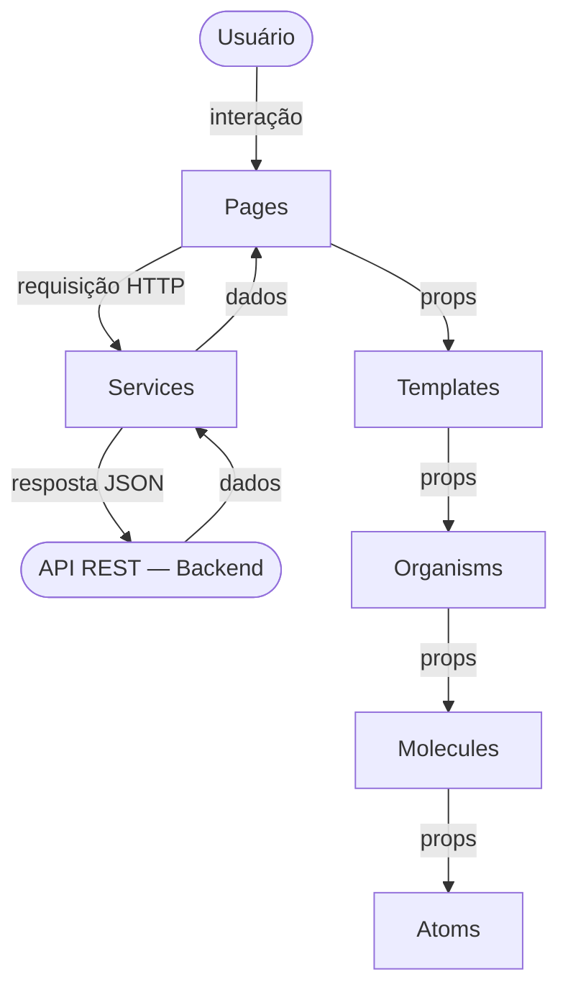

# SkyBook

---

## Parte 1 — Visão Geral

### Descrição

> O **SkyBook** é um sistema de reservas de poltronas de aeronave. Permite que passageiros visualizem a disponibilidade de assentos, realizem reservas e obtenham um resumo consolidado com o valor total a pagar.

### Funcionalidades

- Listagem de poltronas da aeronave com status atual (disponível / indisponível)
- Reserva de uma ou mais poltronas disponíveis, atualizando seu status automaticamente
- Resumo das reservas com valor individual de cada poltrona e valor total

> Escopo e domínio do produto detalhados em [`.kiro/steering/product.md`](.kiro/steering/product.md)

### Demonstração

🎥 [Assista ao vídeo de demonstração no YouTube](https://youtube.com/...)

### Quadro de Tarefas

📋 [Acompanhe o backlog no GitHub Projects](https://github.com/orgs/IA-para-DEVs-SCTEC-T2/projects/26/views/1)

### Melhorias Futuras

- [ ] Autenticação e cadastro de usuários
- [ ] Pagamento online
- [ ] Cancelamento de reservas
- [ ] Suporte a múltiplos voos ou aeronaves
- [ ] Histórico de reservas

---

## Parte 2 — Especificações e Execução

### Arquitetura

#### Estrutura de Diretórios Raiz

```
projeto-avaliativo-m12-SkyBook/
├── backend/    # API REST — Java/Spring Boot
├── frontend/   # Interface web — React + Atomic Design
└── docs/       # Documentação do projeto
```

> Padrão arquitetural e estrutura de pacotes detalhados em [`.kiro/steering/structure.md`](.kiro/steering/structure.md)

---

### 🔧 Backend

#### Estrutura de Pacotes

```
backend/src/main/java/com/ia/para/devs/skybook
├── controller      # Controllers REST
├── service         # Lógica de negócio
├── repository      # Interfaces Spring Data JPA
├── model           # Entidades JPA
└── dto             # DTOs de request e response
```

#### Descrição das Camadas

| Camada | Responsabilidade |
|---|---|
| Controller | Recebe requisições HTTP, delega para o Service, retorna respostas |
| Service | Contém a lógica de negócio |
| Repository | Acesso e persistência de dados via Spring Data JPA |
| Model/Entity | Entidades JPA mapeadas para o banco H2 |
| DTO | Objetos de transferência de dados (entrada e saída dos endpoints) |

#### Diagrama MVC


#### Decisões Técnicas

- Arquitetura MVC para separação clara de responsabilidades
- DTOs para desacoplar a camada de apresentação das entidades JPA — endpoints nunca expõem entidades diretamente
- H2 em memória para simplificar o ambiente de desenvolvimento, com schema gerenciado automaticamente pelo Hibernate

#### Modelagem do Banco de Dados

O banco de dados utilizado é o **H2 em memória**, gerenciado automaticamente pelo Hibernate via Spring Data JPA.

| Entidade | Tabela | Descrição |
|---|---|---|
| `UserEntity` | `app_user` | Dados do usuário que realiza reservas |
| `AirplaneSeatEntity` | `airplane_seat` | Dados de cada poltrona (código, preço, disponibilidade) |
| `BookingEntity` | `booking` | Reserva — vínculo entre um usuário e um assento |

> Diagrama ER completo e descrição das entidades em [`docs/data-model.md`](docs/data-model.md)

---

### 🖥️ Frontend

#### Estrutura de Diretórios

```
frontend/src/
├── atoms/          # Elementos básicos: botão, input, badge
├── molecules/      # Combinações: card de poltrona, campo com label
├── organisms/      # Seções: mapa de assentos, formulário de reserva
├── templates/      # Layouts de página sem dados
├── pages/          # Páginas com dados reais conectados à API
├── services/       # Comunicação com a API REST
└── hooks/          # Custom hooks React
```

#### Descrição das Camadas (Atomic Design)

| Nível | Responsabilidade |
|---|---|
| Atoms | Elementos básicos e indivisíveis da UI |
| Molecules | Combinação de átomos com função específica |
| Organisms | Seções completas compostas de moléculas |
| Templates | Layout de página sem dados reais |
| Pages | Templates com dados reais conectados à API |
| Services | Comunicação com a API REST do backend |
| Hooks | Lógica reutilizável com estado React |

#### Diagrama Atomic Design



#### Decisões Técnicas

- Atomic Design para organização escalável e reutilizável dos componentes
- Camada `services/` centraliza toda comunicação com a API — componentes nunca fazem chamadas HTTP diretamente
- Variável de ambiente `VITE_API_BASE_URL` desacopla o endereço da API do código-fonte

---

### Tecnologias

#### Backend

| Tecnologia | Versão | Finalidade |
|---|---|---|
| Java | 17 | Linguagem principal |
| Spring Boot | 4.0.6 | Framework web |
| Spring Data JPA | — | Persistência de dados |
| H2 Database | — | Banco em memória |
| Lombok | — | Redução de boilerplate |
| SpringDoc OpenAPI | 3.0.2 | Documentação Swagger |
| Maven | — | Build e dependências |

#### Frontend

| Tecnologia | Versão | Finalidade |
|---|---|---|
| React | — | Biblioteca de UI |
| Vite | — | Bundler e servidor de desenvolvimento |
| Axios | — | Cliente HTTP para consumo da API |
| JavaScript (JSX) | — | Linguagem principal |

> Stack completa e configurações de build detalhadas em [`.kiro/steering/tech.md`](.kiro/steering/tech.md)

### Como Executar Localmente

#### Pré-requisitos

- Java 17+
- Maven 3.8+
- Node 20+
- npm 10+

#### Clonando o Repositório

```bash
git clone https://github.com/IA-para-DEVs-SCTEC-T2/projeto-avaliativo-m12-SkyBook.git
cd projeto-avaliativo-m12-SkyBook
```

#### Backend

```bash
cd backend

# Execute com Maven
./mvnw spring-boot:run
```

A aplicação estará disponível em: `http://localhost:8080`

#### Frontend

```bash
cd frontend

# Instale as dependências (apenas na primeira vez)
npm install

# Inicie o servidor de desenvolvimento
npm run dev
```

A interface estará disponível em: `http://localhost:5173`

### Cenários de Uso

---

#### 🔧 Backend

##### Endpoints Disponíveis

| Recurso | Método | URL |
|---|---|---|
| Listar poltronas | GET | `http://localhost:8080/skybook/seats/listSeats` |
| Reservar poltronas | POST | `http://localhost:8080/skybook/bookings/bookSeat` |
| Resumo das reservas | GET | `http://localhost:8080/skybook/bookings/summary?email={email}` |
| Swagger UI | — | `http://localhost:8080/skybook/swagger-ui.html` |
| H2 Console | — | `http://localhost:8080/skybook/h2-console` |

##### Cenário 1 — Listagem de poltronas disponíveis e indisponíveis

**Entrada:** `GET /skybook/seats/listSeats`

**Saída esperada:**
```json
[
  { "id": 1,  "code": "1A",  "price": 198.89, "available": true  },
  { "id": 2,  "code": "1B",  "price": 198.89, "available": false },
  ...
  { "id": 59, "code": "10E", "price": 110.00, "available": true  },
  { "id": 60, "code": "10F", "price": 110.00, "available": false }
]
```

##### Cenário 2 — Reserva de poltronas

**Entrada:** `POST /skybook/bookings/bookSeat`

```json
{
  "passengerName": "João Silva",
  "passengerEmail": "joao@email.com",
  "seatCodes": ["1A", "3C"]
}
```

**Saída esperada (201 Created):**
```json
[
  {
    "bookingId": 1,
    "seatCode": "1A",
    "seatPrice": 198.89,
    "passengerName": "João Silva",
    "bookedAt": "2026-05-29T20:00:00"
  },
  {
    "bookingId": 2,
    "seatCode": "3C",
    "seatPrice": 149.90,
    "passengerName": "João Silva",
    "bookedAt": "2026-05-29T20:00:00"
  }
]
```

**Erros possíveis:**
- `404 Not Found` — código de poltrona não existe
- `409 Conflict` — poltrona já está reservada

##### Cenário 3 — Resumo consolidado das reservas

**Entrada:** `GET /skybook/bookings/summary?email=joao@email.com`

**Saída esperada (200 OK):**
```json
{
  "passengerName": "João Silva",
  "passengerEmail": "joao@email.com",
  "totalAmount": 348.79,
  "bookings": [
    {
      "bookingId": 1,
      "seatCode": "1A",
      "seatPrice": 198.89,
      "bookedAt": "2026-05-29T20:00:00"
    },
    {
      "bookingId": 2,
      "seatCode": "3C",
      "seatPrice": 149.90,
      "bookedAt": "2026-05-29T20:00:00"
    }
  ]
}
```

**Erros possíveis:**
- `404 Not Found` — e-mail não encontrado no sistema

---

#### 🖥️ Frontend

##### Cenário 1 — Visualização do grid de poltronas

**Acesso:** `http://localhost:5173/` → redireciona automaticamente para `http://localhost:5173/skybook`

Ao acessar a aplicação, o passageiro visualiza um grid com as 60 poltronas da aeronave organizadas em 10 fileiras × 6 colunas (A–F):

-  — poltrona disponível para reserva
-  — poltrona já reservada (indisponível)
-  — poltrona selecionada pelo passageiro na sessão atual

O painel lateral exibe o total acumulado iniciando em **R$ 0,00**.

> ⚠️ Se o backend estiver indisponível ao carregar a página, o sistema exibe uma mensagem de erro amigável no lugar do grid.

##### Cenário 2 — Seleção e deseleção de poltronas

O passageiro clica em uma poltrona  (disponível):

- A poltrona muda para  (selecionada)
- O valor unitário da poltrona é somado ao total exibido no painel lateral

O passageiro clica novamente na mesma poltrona :

- A poltrona volta para  (disponível)
- O valor é subtraído do total

Clicar em uma poltrona  (indisponível) não produz nenhum efeito.

##### Cenário 3 — Reserva de poltronas (fluxo de dois modais)

Com ao menos uma poltrona selecionada, o botão **"Realizar Reserva"** no painel lateral é habilitado.

**Passo 1 — Modal de resumo ("Confirmar Reserva?"):**

O passageiro clica em "Realizar Reserva". Um modal exibe:
- Lista das poltronas selecionadas com seus valores individuais
- Valor total acumulado
- Botões: **"Continuar"**, **"Cancelar"** e **"✕"**

**Passo 2 — Modal de dados do passageiro ("Confirmar Reserva?"):**

O passageiro clica em "Continuar". Um segundo modal exibe:
- Campo **Nome completo**
- Campo **E-mail**
- Botões: **"Confirmar Reserva"**, **"Cancelar"** e **"✕"**

O botão "Confirmar Reserva" fica habilitado somente após o preenchimento de ambos os campos.

**Confirmação:**

Ao clicar em "Confirmar Reserva", o sistema envia `POST /bookings/bookSeat`. Em caso de sucesso:
- Os modais são fechados
- A seleção é limpa
- O mapa de poltronas é recarregado automaticamente com as poltronas reservadas marcadas como indisponíveis

Em caso de erro na API, uma mensagem amigável é exibida no modal sem perder a seleção atual.

### Como Executar os Testes

#### Backend

```bash
cd backend
./mvnw test
```

#### Frontend

```bash
cd frontend
npm test
```

| Módulo | Tipo | Cenários cobertos |
|---|---|---|
| Backend | Unitários | Service layer — regras de negócio |
| Backend | Integração / API | Endpoints REST — status codes e payloads |
| Frontend | Unitários | Renderização dos componentes React |

### Pipeline CI/CD

Configurado via GitHub Actions em [`.github/workflows/ci.yml`](.github/workflows/ci.yml).

**Gatilhos:** push em qualquer branch e pull requests para `develop` e `main`.

**Jobs:**

| Job | Módulo | Comando | Descrição |
|---|---|---|---|
| `backend-build` | Backend | `./mvnw package -DskipTests` | Compila o projeto e gera o `.jar` |
| `backend-test` | Backend | `./mvnw test` | Executa os testes (depende do `backend-build`) |
| `frontend-build` | Frontend | `npm run build` | Compila o projeto React |
| `frontend-test` | Frontend | `npm test` | Executa os testes (depende do `frontend-build`) |
| `ci-passed` | — | — | Gate final — depende de `backend-test` e `frontend-test` |

Os relatórios de teste do backend (Surefire) são publicados como artefato na aba **Actions** do GitHub, retidos por 7 dias.

---

## Parte 3 — Uso de IA no Desenvolvimento

### Ferramentas de IA Utilizadas

| Etapa | Ferramenta | Modelo | Descrição do uso |
|---|---|---|---|
| Especificação | Kiro | Claude Sonnet 4.6 | Definição de requisitos, escopo e steerings do projeto |
| Arquitetura | Kiro | Claude Sonnet 4.6 | Planejamento da estrutura MVC e modelagem de dados |
| Geração de código | Kiro | Claude Sonnet 4.6 | Criação das entidades JPA e DTOs |
| Refatoração | Kiro | Claude Sonnet 4.6 | Refatoração do BookingService com princípios SOLID (SRP, DIP) e Clean Code |
| Testes | Kiro | Claude Sonnet 4.6 | Geração da suíte de testes unitários com JUnit e Mockito |
| Documentação | Kiro | Claude Sonnet 4.6 | Criação do data-model, template de README e docs/prompts.md |
| Pipeline CI/CD | [ex: Kiro] | [ex: Claude Sonnet 4.6] | [ex: Configuração do GitHub Actions] |

### Padrões de Prompting Aplicados

Os prompts utilizados estão organizados em [`docs/prompts.md`](docs/prompts.md).

#### Zero Shot

**Quando foi usado:** Criação do steering de produto — instrução direta sem exemplos prévios de formato ou conteúdo.

**Prompt original:**
```
Instrução
Crie o steering the produto deste projeto.
Detalhes
1. Esse projeto é um sistema de reservas de poltronas de uma aeronave.
2. As funcionalidades para o MVP devem ser:
2.1. Listar as poltronas da aeronave com seu status (disponível ou não).
2.2. Realizar as reservas de poltronas escolhidas.
2.3. Obter o resumo das reservas e o valor total.
```

#### Few Shot

**Quando foi usado:** Criação das entidades JPA — o prompt forneceu um exemplo concreto da estrutura de código esperada.

**Prompt original:**
```
Crie as entidades de acordo com a modelagem do projeto.
As entidades devem ser criadas seguindo este exemplo:
<code>
@Entity
@Data
@Table(name = "table_name")
@FieldDefaults(level = AccessLevel.PRIVATE)
@EqualsAndHashCode(of = "id")
public class <entity-name>Entity {...}
<code>
Restrições
Apenas crie as entidades neste momento. Não crie outras funcionalidades não solicitadas.
```

#### Chain of Thought

**Quando foi usado:** [Cole aqui o prompt Chain of Thought utilizado]

**Prompt original:**
```
[Cole aqui o prompt Chain of Thought utilizado]
```

### Ciclos de Geração e Refinamento com IA

> Documentação detalhada dos ciclos em [`docs/feat-list-seats.md`](docs/feat-list-seats.md)

#### Ciclo 1 — [Nome da funcionalidade]

**Padrão:** [ex: Zero Shot]

**Prompt utilizado:** ver [`docs/prompts.md`](docs/prompts.md)

**Resultado gerado:** [Descreva o que foi gerado]

**Avaliação crítica:** [O que estava correto / incorreto / o que foi ajustado]

#### Ciclo 2 — [Nome da funcionalidade]

**Padrão:** [ex: Few Shot]

**Prompt utilizado:** ver [`docs/prompts.md`](docs/prompts.md)

**Resultado gerado:** [Descreva o que foi gerado]

**Avaliação crítica:** [O que estava correto / incorreto / o que foi ajustado]

#### Ciclo 3 — [Nome da funcionalidade]

**Padrão:** [ex: Chain of Thought]

**Prompt utilizado:** ver [`docs/prompts.md`](docs/prompts.md)

**Resultado gerado:** [Descreva o que foi gerado]

**Avaliação crítica:** [O que estava correto / incorreto / o que foi ajustado]

### Refatoração com IA

**Critério aplicado:** [ex: Princípio da Responsabilidade Única (SOLID), Clean Code]

**Antes:**
```java
// Código antes da refatoração
```

**Prompt utilizado:**
```
[Cole o prompt de refatoração aqui]
```

**Depois:**
```java
// Código após a refatoração
```

**Avaliação do resultado:** [Descreva o que melhorou e o que foi aprendido]

### Análise Crítica — Saída Incorreta da IA

**Problema identificado:**

[Descreva o que a IA gerou de incorreto ou insuficiente]

**Correção aplicada:**

[Descreva o que foi corrigido e como]

**Lição aprendida:**

[O que esse caso ensinou sobre o uso de IA no desenvolvimento]
