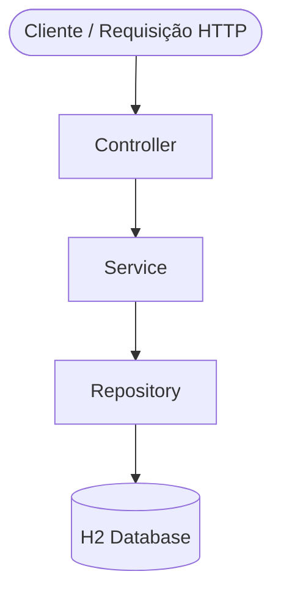

# SkyBook

---

## Parte 1 — Visão Geral

### Descrição

> O **SkyBook** é um sistema de reservas de poltronas de aeronave. Permite que passageiros visualizem a disponibilidade de assentos, realizem reservas e obtenham um resumo consolidado com o valor total a pagar.

### Funcionalidades

- Listagem de poltronas da aeronave com status atual (disponível / indisponível)
- Reserva de uma ou mais poltronas disponíveis, atualizando seu status automaticamente
- Resumo das reservas com valor individual de cada poltrona e valor total

> Escopo e domínio do produto detalhados em [`.kiro/steering/product.md`](.kiro/steering/product.md)

### Demonstração

🎥 [Assista ao vídeo de demonstração no YouTube](https://youtube.com/...)

### Quadro de Tarefas (Kanban)

📋 [Acompanhe o backlog no GitHub Projects](https://github.com/orgs/IA-para-DEVs-SCTEC-T2/projects/26/views/1)

📄 [Veja a lista de todas as issues do projeto](docs/issues.md)

### Melhorias Futuras

- [ ] Autenticação e cadastro de usuários
- [ ] Pagamento online
- [ ] Cancelamento de reservas
- [ ] Suporte a múltiplos voos ou aeronaves
- [ ] Histórico de reservas

---

## Parte 2 — Especificações e Execução

### Arquitetura

#### Estrutura de Diretórios Raiz

```
projeto-avaliativo-m12-SkyBook/
├── backend/    # API REST — Java/Spring Boot
├── frontend/   # Interface web — React + Atomic Design
└── docs/       # Documentação do projeto
```

> Padrão arquitetural e estrutura de pacotes detalhados em [`.kiro/steering/structure.md`](.kiro/steering/structure.md)

---

### 🔧 Backend

#### Estrutura de Pacotes

```
backend/src/main/java/com/ia/para/devs/skybook
├── config/
│   ├── AirplaneSeatDataLoader.java   # Carga inicial das 60 poltronas
│   └── WebConfig.java                # Configuração de CORS
├── controller/
│   ├── AirplaneSeatController.java   # GET /seats/listSeats
│   ├── BookingController.java        # POST /bookings/bookSeat, GET /bookings/summary
│   └── GlobalExceptionHandler.java   # Tratamento centralizado de erros
├── dto/
│   ├── AirplaneSeatResponseDTO.java
│   ├── BookingItemDTO.java
│   ├── BookingRequestDTO.java
│   ├── BookingResponseDTO.java
│   ├── BookingSummaryResponseDTO.java
│   └── ErrorResponseDTO.java
├── model/
│   ├── AirplaneSeatEntity.java       # Tabela airplane_seat
│   ├── BookingEntity.java            # Tabela booking
│   └── UserEntity.java               # Tabela app_user
├── repository/
│   ├── AirplaneSeatRepository.java
│   ├── BookingRepository.java
│   └── UserRepository.java
├── service/
│   ├── AirplaneSeatService.java
│   ├── BookingService.java
│   └── UserService.java
└── SkybookApplication.java           # Entry point
```

#### Descrição das Camadas

| Camada | Responsabilidade |
|---|---|
| Controller | Recebe requisições HTTP, delega para o Service, retorna respostas |
| Service | Contém a lógica de negócio |
| Repository | Acesso e persistência de dados via Spring Data JPA |
| Model/Entity | Entidades JPA mapeadas para o banco H2 |
| DTO | Objetos de transferência de dados (entrada e saída dos endpoints) |

#### Diagrama MVC



#### Decisões Técnicas

- Arquitetura MVC para separação clara de responsabilidades
- DTOs para desacoplar a camada de apresentação das entidades JPA — endpoints nunca expõem entidades diretamente
- H2 em memória para simplificar o ambiente de desenvolvimento, com schema gerenciado automaticamente pelo Hibernate

#### Modelagem do Banco de Dados

O banco de dados utilizado é o **H2 em memória**, gerenciado automaticamente pelo Hibernate via Spring Data JPA.

| Entidade | Tabela | Descrição |
|---|---|---|
| `UserEntity` | `app_user` | Dados do usuário que realiza reservas |
| `AirplaneSeatEntity` | `airplane_seat` | Dados de cada poltrona (código, preço, disponibilidade) |
| `BookingEntity` | `booking` | Reserva — vínculo entre um usuário e um assento |

> Diagrama ER completo e descrição das entidades em [`docs/data-model.md`](docs/data-model.md)

---

### 🖥️ Frontend

#### Estrutura de Diretórios

```
frontend/src/
├── atoms/
│   ├── Modal/                        # Componente base de modal
│   ├── MoneyValue/                   # Exibição de valores monetários
│   ├── StatusBadge/                  # Badge de status da poltrona
│   └── Text/                         # Componente de texto
├── molecules/
│   └── SeatCard/                     # Card de poltrona (disponível/indisponível/selecionado)
├── organisms/
│   ├── BookingSummaryModal/          # Modal de consulta de reservas por e-mail
│   ├── ConfirmBookingModal/          # Modal passo 1 — resumo da seleção
│   ├── PassengerFormModal/           # Modal passo 2 — dados do passageiro
│   ├── SeatMap/                      # Grid de 60 poltronas
│   └── TotalPanel/                   # Painel lateral com total e botões de ação
├── templates/
│   ├── MainLayout/                   # Layout base da aplicação
│   └── SeatMapLayout/                # Layout da tela de seleção de poltronas
├── pages/
│   ├── HomePage/                     # Redireciona para /skybook
│   └── SeatMapPage/                  # Página principal com grid + painel
├── services/
│   ├── bookingService.js             # POST /bookings/bookSeat, GET /bookings/summary
│   └── seatsService.js               # GET /seats/listSeats
├── hooks/
│   ├── useBooking.js                 # Lógica de reserva e modais
│   └── useSeatSelection.js           # Gerenciamento de seleção e cálculo do total
├── App.jsx                           # Configuração de rotas
└── main.jsx                          # Entry point
```

#### Descrição das Camadas (Atomic Design)

| Nível | Responsabilidade |
|---|---|
| Atoms | Elementos básicos e indivisíveis da UI |
| Molecules | Combinação de átomos com função específica |
| Organisms | Seções completas compostas de moléculas |
| Templates | Layout de página sem dados reais |
| Pages | Templates com dados reais conectados à API |
| Services | Comunicação com a API REST do backend |
| Hooks | Lógica reutilizável com estado React |

#### Diagrama Atomic Design


#### Decisões Técnicas

- Atomic Design para organização escalável e reutilizável dos componentes
- Camada `services/` centraliza toda comunicação com a API — componentes nunca fazem chamadas HTTP diretamente
- Variável de ambiente `VITE_API_BASE_URL` desacopla o endereço da API do código-fonte

---

### Tecnologias

#### Backend

| Tecnologia | Versão | Finalidade |
|---|---|---|
| Java | 17 | Linguagem principal |
| Spring Boot | 4.0.6 | Framework web |
| Spring Data JPA | — | Persistência de dados |
| H2 Database | — | Banco em memória |
| Lombok | — | Redução de boilerplate |
| SpringDoc OpenAPI | 3.0.2 | Documentação Swagger |
| Maven | — | Build e dependências |

#### Frontend

| Tecnologia | Versão | Finalidade |
|---|---|---|
| React | — | Biblioteca de UI |
| Vite | — | Bundler e servidor de desenvolvimento |
| Axios | — | Cliente HTTP para consumo da API |
| JavaScript (JSX) | — | Linguagem principal |

> Stack completa e configurações de build detalhadas em [`.kiro/steering/tech.md`](.kiro/steering/tech.md)

### Como Executar Localmente

#### Pré-requisitos

- Java 17+
- Maven 3.8+
- Node 20+
- npm 10+

#### Clonando o Repositório

```bash
git clone https://github.com/IA-para-DEVs-SCTEC-T2/projeto-avaliativo-m12-SkyBook.git
cd projeto-avaliativo-m12-SkyBook
```

#### Backend

```bash
cd backend

# Execute com Maven
./mvnw spring-boot:run
```

> No Windows CMD, use `mvnw.cmd spring-boot:run` em vez de `./mvnw spring-boot:run`

A aplicação estará disponível em: `http://localhost:8080`

#### Frontend

```bash
cd frontend

# Instale as dependências (apenas na primeira vez)
npm install

# Inicie o servidor de desenvolvimento
npm run dev
```

A interface estará disponível em: `http://localhost:5173`

### Cenários de Uso

---

#### 🔧 Backend

##### Endpoints Disponíveis

| Recurso | Método | URL |
|---|---|---|
| Listar poltronas | GET | `http://localhost:8080/skybook/seats/listSeats` |
| Reservar poltronas | POST | `http://localhost:8080/skybook/bookings/bookSeat` |
| Resumo das reservas | GET | `http://localhost:8080/skybook/bookings/summary?email={email}` |
| Swagger UI | — | `http://localhost:8080/skybook/swagger-ui.html` |
| H2 Console | — | `http://localhost:8080/skybook/h2-console` |

##### Cenário 1 — Listagem de poltronas disponíveis e indisponíveis

**Entrada:** `GET /skybook/seats/listSeats`

**Saída esperada:**
```json
[
  { "id": 1,  "code": "1A",  "price": 198.89, "available": true  },
  { "id": 2,  "code": "1B",  "price": 198.89, "available": false },
  ...
  { "id": 59, "code": "10E", "price": 110.00, "available": true  },
  { "id": 60, "code": "10F", "price": 110.00, "available": false }
]
```

##### Cenário 2 — Reserva de poltronas

**Entrada:** `POST /skybook/bookings/bookSeat`

```json
{
  "passengerName": "João Silva",
  "passengerEmail": "joao@email.com",
  "seatCodes": ["1A", "3C"]
}
```

**Saída esperada (201 Created):**
```json
[
  {
    "bookingId": 1,
    "seatCode": "1A",
    "seatPrice": 198.89,
    "passengerName": "João Silva",
    "bookedAt": "2026-05-29T20:00:00"
  },
  {
    "bookingId": 2,
    "seatCode": "3C",
    "seatPrice": 149.90,
    "passengerName": "João Silva",
    "bookedAt": "2026-05-29T20:00:00"
  }
]
```

**Erros possíveis:**
- `404 Not Found` — código de poltrona não existe
- `409 Conflict` — poltrona já está reservada

##### Cenário 3 — Resumo consolidado das reservas

**Entrada:** `GET /skybook/bookings/summary?email=joao@email.com`

**Saída esperada (200 OK):**
```json
{
  "passengerName": "João Silva",
  "passengerEmail": "joao@email.com",
  "totalAmount": 348.79,
  "bookings": [
    {
      "bookingId": 1,
      "seatCode": "1A",
      "seatPrice": 198.89,
      "bookedAt": "2026-05-29T20:00:00"
    },
    {
      "bookingId": 2,
      "seatCode": "3C",
      "seatPrice": 149.90,
      "bookedAt": "2026-05-29T20:00:00"
    }
  ]
}
```

**Erros possíveis:**
- `404 Not Found` — e-mail não encontrado no sistema

---

#### 🖥️ Frontend

##### Cenário 1 — Visualização das poltronas

**Acesso:** `http://localhost:5173/` → redireciona automaticamente para `http://localhost:5173/skybook`

Ao acessar a aplicação, o passageiro visualiza um grid com as 60 poltronas da aeronave organizadas em 10 fileiras × 6 colunas (A–F):

-  — poltrona disponível para reserva
-  — poltrona já reservada (indisponível)

> ⚠️ Se o backend estiver indisponível ao carregar a página, o sistema exibe uma mensagem de erro amigável no lugar do grid.

##### Cenário 2 — Realização da reserva

O passageiro clica em uma poltrona  (disponível):

- A poltrona muda para  (selecionada)
- O valor unitário da poltrona é somado ao total exibido no painel lateral

Com ao menos uma poltrona selecionada, o botão **"Realizar Reserva"** no painel lateral é habilitado.

**Passo 1 — Modal de resumo ("Confirmar Reserva?"):**

O passageiro clica em "Realizar Reserva". Um modal exibe:
- Lista das poltronas selecionadas com seus valores individuais
- Valor total acumulado
- Botões: **"Continuar"**, **"Cancelar"** e **"✕"**

**Passo 2 — Modal de dados do passageiro ("Confirmar Reserva?"):**

O passageiro clica em "Continuar". Um segundo modal exibe:
- Campo **Nome completo**
- Campo **E-mail**
- Botões: **"Confirmar Reserva"**, **"Cancelar"** e **"✕"**

O botão "Confirmar Reserva" fica habilitado somente após o preenchimento de ambos os campos.

**Confirmação:**

Ao clicar em "Confirmar Reserva", o sistema envia `POST /bookings/bookSeat`. Em caso de sucesso:
- Os modais são fechados
- A seleção é limpa
- O mapa de poltronas é recarregado automaticamente com as poltronas reservadas marcadas como indisponíveis

Em caso de erro na API, uma mensagem amigável é exibida no modal sem perder a seleção atual.

##### Cenário 3 — Consulta de reservas realizadas

O passageiro clica em **"Consultar Reservas"** (botão abaixo de "Realizar Reserva" no painel lateral). Um modal é aberto com:

- Campo **E-mail** e botão **"Buscar"**

Após informar o e-mail e clicar em "Buscar", o sistema chama `GET /bookings/summary?email=`:

- **E-mail encontrado:** o modal exibe o nome do passageiro, a lista de poltronas reservadas com código e preço individual, e o valor total
- **E-mail não encontrado (404):** mensagem informando que nenhuma reserva foi encontrada para o e-mail informado
- **API indisponível:** mensagem de erro amigável

### Como Executar os Testes

#### Backend

```bash
cd backend
./mvnw test
```

> No Windows CMD, use `mvnw.cmd test` em vez de `./mvnw test`

#### Frontend

```bash
cd frontend
npm test
```

| Módulo | Tipo | Cenários cobertos |
|---|---|---|
| Backend | Unitários | Service layer — regras de negócio |
| Backend | Integração / API | Endpoints REST — status codes e payloads |
| Frontend | Unitários | Renderização dos componentes React |

### Pipeline CI/CD

Configurado via GitHub Actions em [`.github/workflows/ci.yml`](.github/workflows/ci.yml).

**Gatilhos:** push em qualquer branch e pull requests para `develop` e `main`.

**Jobs:**

| Job | Módulo | Comando | Descrição |
|---|---|---|---|
| `backend-build` | Backend | `./mvnw package -DskipTests` | Compila o projeto e gera o `.jar` |
| `backend-test` | Backend | `./mvnw test` | Executa os testes (depende do `backend-build`) |
| `frontend-build` | Frontend | `npm run build` | Compila o projeto React |
| `frontend-test` | Frontend | `npm test` | Executa os testes (depende do `frontend-build`) |
| `ci-passed` | — | — | Gate final — depende de `backend-test` e `frontend-test` |

Os relatórios de teste do backend (Surefire) são publicados como artefato na aba **Actions** do GitHub, retidos por 7 dias.

---

## Parte 3 — Uso de IA no Desenvolvimento

### Ferramentas de IA Utilizadas

| Etapa | Ferramenta | Modelo | Descrição do uso |
|---|---|---|---|
| Especificação | Kiro | Claude Sonnet 4.6 | Definição de requisitos, escopo e steerings do projeto |
| Arquitetura | Kiro | Claude Sonnet 4.6 | Planejamento da estrutura MVC, Atomic Design e modelagem de dados |
| Geração de código | Kiro | Claude Sonnet 4.6 | Criação das entidades JPA, DTOs, serviços e controllers (backend) e componentes React com Atomic Design (frontend) |
| Refatoração | Kiro | Claude Sonnet 4.6 | Refatoração do BookingService com princípios SOLID (SRP, DIP) e Clean Code |
| Testes | Kiro | Claude Sonnet 4.6 | Geração da suíte de testes unitários com JUnit e Mockito (backend) e Vitest + React Testing Library (frontend) |
| Documentação | Kiro | Claude Sonnet 4.6 | Criação dos steerings, data-model, README, documentação das issues, docs/prompts.md e ciclos de desenvolvimento |
| Pipeline CI/CD | Kiro | Claude Sonnet 4.6 | Configuração do GitHub Actions com jobs de build e test para backend e frontend, artefatos Surefire e gate ci-passed |

### Padrões de Prompting Aplicados

Os prompts utilizados estão organizados em [`docs/prompts.md`](docs/prompts.md).

#### Ciclos de Desenvolvimento

Os ciclos de desenvolvimento de cada funcionalidade estão documentados nos arquivos abaixo, divididos entre as frentes de backend e frontend:

**Backend:**
- [`docs/development-cycles/backend/feat-list-seats.md`](docs/development-cycles/backend/feat-list-seats.md)
- [`docs/development-cycles/backend/feat-book-seat.md`](docs/development-cycles/backend/feat-book-seat.md)
- [`docs/development-cycles/backend/feat-summary.md`](docs/development-cycles/backend/feat-summary.md)

**Frontend:**
- [`docs/development-cycles/frontend/feat-list-seats.md`](docs/development-cycles/frontend/feat-list-seats.md)
- [`docs/development-cycles/frontend/feat-book-seat.md`](docs/development-cycles/frontend/feat-book-seat.md)
- [`docs/development-cycles/frontend/feat-summary.md`](docs/development-cycles/frontend/feat-summary.md)

> O exemplo abaixo ilustra como os ciclos de desenvolvimento de uma funcionalidade foram documentados. O conteúdo completo está em [`docs/development-cycles/backend/feat-book-seat.md`](docs/development-cycles/backend/feat-book-seat.md).
>
> Cada ciclo utiliza um padrão de prompt diferente — Zero shot na geração inicial, Few shot no refinamento e Chain of Thought quando a alteração se propaga por múltiplos arquivos.

##### Exemplo — Reserva de Poltronas (`POST /bookings/bookSeat`)

**Ciclo 1 — Geração Inicial (Zero shot)**

Prompt enviado sem exemplos ou estrutura de raciocínio explícita. A IA recebeu a descrição da demanda e gerou a implementação completa a partir do zero: `BookingRequestDTO`, `BookingResponseDTO`, `BookingRepository`, `UserRepository`, `BookingService`, `BookingController` e testes unitários. Resultado: 17 testes passando.

```
Busque a issue 15 Realização de reserva de poltrona e implemente suas funcionalidades e implemente testes unitários
```

**Ciclo 2 — Refinamento (Few shot)**

Prompt com exemplo concreto de `@ExceptionHandler`. A IA usou o exemplo como referência para criar o `ErrorResponseDTO`, o `GlobalExceptionHandler` e ajustar a rota para `/bookings/bookSeat`. Resultado: erros da API passaram a retornar respostas padronizadas.

```
Realize os seguintes ajustes:
1. O endpoint para a realização da reserva deve ter a rota /bookings/bookSeat
2. Crie um DTO para armazenar as informações de erros. Ele deve conter o status do erro, a mensagem de erro e o timestamp de quando ocorreu.
3. Para lidar com os erros desse endpoint, deve ser criada a classe GlobalExceptionHandler que deve capturar os erros e retornar o objeto DTO que armazena as informações de erro.
Como nesse exemplo:
@ExceptionHandler(<excpetion-name>.class)
public ResponseEntity<<error-dto>> handlerBadRequest(<excpetion-name> ex) {
    return ResponseEntity
            .status(HttpStatus.<status>)
            .body(new <error-dto>(HttpStatus.<status>.name(), ex.getMessage(), LocalDateTime.now()));
}
```

**Ciclo 3 — Padrão Diferente (Chain of Thought)**

Prompt solicitando que a IA descrevesse seu raciocínio antes de agir. A IA mapeou os 5 pontos afetados pela mudança de `seatIds` para `seatCodes` (`BookingRequestDTO`, `AirplaneSeatRepository`, `BookingService`, `BookingServiceTest`, `BookingControllerTest`) e só então aplicou as alterações. Resultado: 17 testes passando com o endpoint aceitando `["1A", "3C"]` em vez de `[1, 3]`.

```
Em vez de Ids, a lista de poltronas no objeto de entrada do enpoint bookSeat deve ser formado pelos códigos string das poltronas. Altere todos os pontos necessários.
Quebre essa alteração em pequenos passos, descrevendo seu processo de pensamento, e aplique as alterações.
```

**Lição geral**

A qualidade da saída da IA é diretamente proporcional à qualidade do prompt. Um prompt vago gera código funcional, mas com decisões arbitrárias. Um prompt com exemplos, restrições e raciocínio explícito gera código alinhado com as convenções do projeto. A IA é um parceiro de desenvolvimento eficaz — mas o desenvolvedor precisa saber o que quer e saber comunicar isso com precisão.

### Refatoração com IA

A refatoração do `BookingService` — serviço responsável pela lógica de criação de reservas de poltronas — foi realizada durante o ciclo de desenvolvimento da funcionalidade de reserva de poltronas. O processo completo — com estado anterior do código, prompt utilizado, resultado gerado e avaliação — está documentado em [`docs/development-cycles/backend/feat-book-seat.md`](docs/development-cycles/backend/feat-book-seat.md).

**Antes da refatoração**

O `BookingService` acumulava quatro responsabilidades distintas em um único método `createBookings`: busca e validação de poltronas, criação/reutilização de usuário, atualização do status da poltrona e persistência da reserva. Além disso, dependia diretamente de três repositórios (`AirplaneSeatRepository`, `UserRepository` e `BookingRepository`), violando o DIP.

**Prompt utilizado (Chain of Thought):**

```
Refatore a classe BookingService, usando princípios do SOLID e clean code.
1. Por exemplo, seguindo o Princípio da Responsabilidade Única, separe a funcionalidade do método createBookings em métodos menores.
2. Além disso, faça ajustes para que a busca e a atualização de poltronas seja realizada no AirplaneSeatService. A busca e criação de usuáros seja feita no UserService. Enquanto o BookingService apenas lida com o que diz respeito as reservas.
3. Os repositórios airplaneSeatRepository, bookingRepository e userRepository somente devem ser acessados pelos serviços correspondentes.
Faça ajustes nos testes unitários para que estejam de acordo com estas alterações.
Divida as alterações em pequenos passos, demostrando a sua linha de pensamento, e, depois, aplique as alterações.
```

**Após a refatoração**

Cada serviço passou a ter responsabilidade única: `AirplaneSeatService` busca e atualiza poltronas, `UserService` cria e recupera usuários, e `BookingService` orquestra apenas a reserva — dependendo de serviços, não de repositórios. O método `createBookings` foi decomposto em métodos menores com nomes expressivos (`bookSeat`, `persistBooking`, `toResponseDTO`).

**Lição aprendida**

A IA não aplica SOLID automaticamente na geração inicial — ela prioriza funcionalidade. A refatoração precisa ser solicitada explicitamente, com os critérios técnicos descritos. Quando o prompt é específico (SRP, DIP, quais classes devem ter quais responsabilidades), a IA executa a refatoração de forma precisa e rastreável. O resultado foram 21 testes passando, contra 17 antes da refatoração.