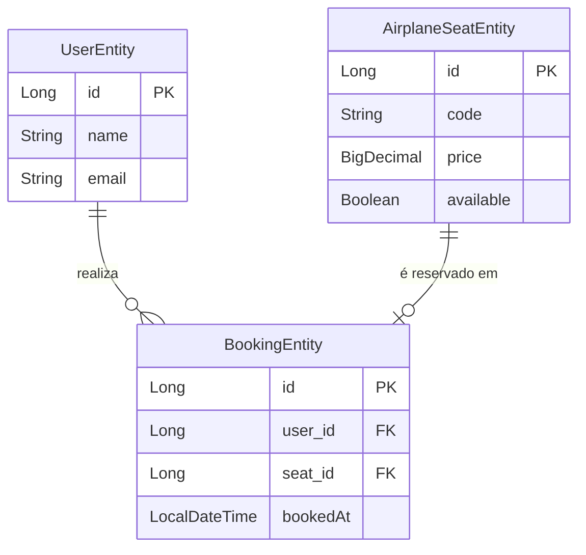

# Modelagem de Dados — SkyBook

## Diagrama de Entidades (ER)

## Descrição das Entidades

### UserEntity
Armazena os dados do usuário que realiza reservas.

| Campo | Tipo   | Restrições              | Descrição           |
|-------|--------|-------------------------|---------------------|
| id    | Long   | PK, auto-gerado         | Identificador único |
| name  | String | NOT NULL, max 150 chars | Nome completo       |
| email | String | NOT NULL, UNIQUE        | E-mail do usuário   |

**Tabela:** `app_user`

---

### AirplaneSeatEntity
Armazena os dados de cada poltrona da aeronave.

| Campo     | Tipo       | Restrições              | Descrição                                 |
|-----------|------------|-------------------------|-------------------------------------------|
| id        | Long       | PK, auto-gerado         | Identificador único                       |
| code      | String     | NOT NULL, UNIQUE, max 5 | Código do assento (ex: `1A`, `12C`)       |
| price     | BigDecimal | NOT NULL                | Preço do assento                          |
| available | Boolean    | NOT NULL                | `true` = disponível, `false` = reservado  |

**Tabela:** `airplane_seat`

---

### BookingEntity
Representa a reserva — vínculo entre um usuário e um assento.

| Campo    | Tipo          | Restrições              | Descrição                          |
|----------|---------------|-------------------------|------------------------------------|
| id       | Long          | PK, auto-gerado         | Identificador único                |
| user_id  | Long          | FK → UserEntity         | Usuário que realizou a reserva     |
| seat_id  | Long          | FK → AirplaneSeatEntity, UNIQUE | Assento reservado (único por reserva) |
| bookedAt | LocalDateTime | NOT NULL                | Data e hora da reserva (auto-fill) |

**Tabela:** `booking`

---

## Relacionamentos

| Relação                                | Cardinalidade | Descrição                                              |
|----------------------------------------|---------------|--------------------------------------------------------|
| `UserEntity` → `BookingEntity`         | 1 para N      | Um usuário pode reservar múltiplos assentos            |
| `AirplaneSeatEntity` → `BookingEntity` | 1 para 0..1   | Um assento possui no máximo uma reserva ativa          |
