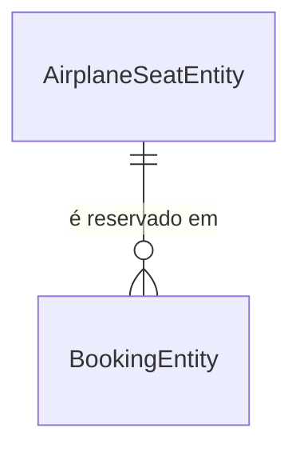
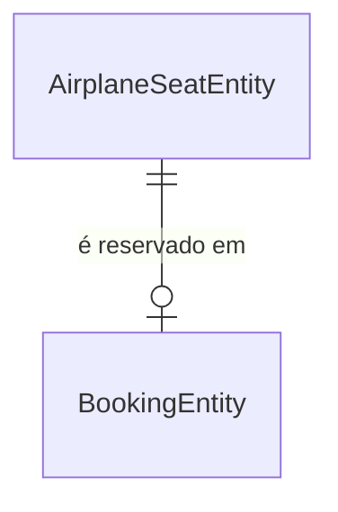

# Refinamento de Output — Modelagem de Dados

## Contexto

Este documento registra o processo de refinamento do prompt utilizado para modelar as entidades do banco de dados do SkyBook, evidenciando como uma instrução de correção simples ajustou o relacionamento entre `BookingEntity` e `AirplaneSeatEntity`.

---

## Prompt inicial

> Vamos criar agora a modelagem da base de dados. Criando 3 entitdades:
> AirplaneSeatEntity: armazena dados do assento do avião.
> UserEntity: armazena dados do usuário
> BookingEntity: armazena os dados da reserva
> Detalhes
> 1. Crie um diagrama do tipo Mermaid para representar as entidades em um arquivo no diretório docs/
> 2. Adicione as entidades no arquivo de estrutura do projeto
> Restrições
> Apenas crie e atualize as documentações.
> Proibido criar as entidades de fato neste momento.

### Output gerado

O diagrama foi criado com o relacionamento entre `AirplaneSeatEntity` e `BookingEntity` modelado como **1 para N** (um assento poderia aparecer em múltiplas reservas), o que implicitamente suportava um histórico de reservas por assento.

---

## Problema identificado

O output inicial assumiu que um assento poderia ter múltiplas reservas ao longo do tempo (histórico). Porém, o escopo do MVP não inclui histórico de reservas — um assento tem **no máximo uma reserva ativa**.

---

## Prompt de refinamento

> Não vamos ter uma funcionalidade de histórico de reservas. Então pode manter os relacionamentos mais simples.

---

## Output refinado

O relacionamento foi corrigido para **1 para 0..1** (um assento possui no máximo uma reserva), e o campo `seat_id` na `BookingEntity` passou a ter restrição `UNIQUE`.

| Campo   | Antes                  | Depois                          |
|---------|------------------------|---------------------------------|
| `seat_id` | FK sem restrição única | FK + `UNIQUE` (1 reserva por assento) |
| Cardinalidade | 1:N (histórico implícito) | 1:0..1 (reserva ativa única) |

---

## Lição aprendida

Ao modelar entidades sem especificar explicitamente a cardinalidade dos relacionamentos, o modelo tende a assumir o caso mais genérico (1:N). Para domínios com restrições de negócio específicas — como "um assento só pode ter uma reserva ativa" — é importante incluir essa restrição no prompt inicial para evitar retrabalho.

**Prompt melhorado sugerido:**

> Crie a modelagem das entidades `AirplaneSeatEntity`, `UserEntity` e `BookingEntity`. Um assento pode ter **no máximo uma reserva ativa** (sem histórico). Um usuário pode ter múltiplas reservas. Gere o diagrama Mermaid em `docs/` e atualize o steering de estrutura.
