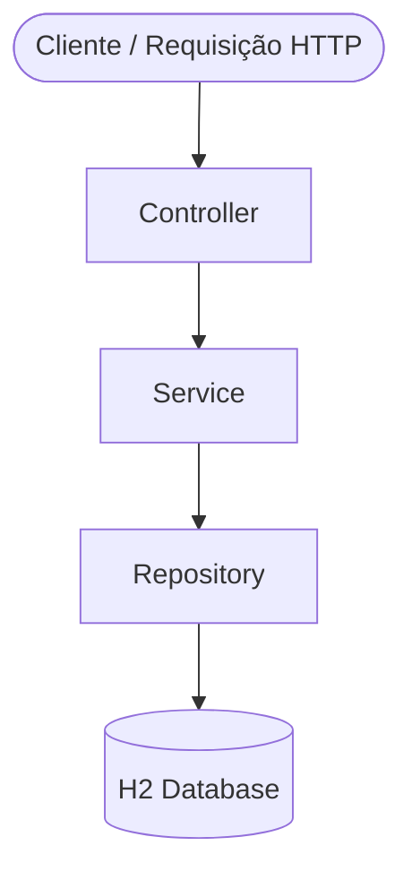

# [Nome da Aplicação]

---

## Parte 1 — Visão Geral

### Descrição

> Breve descrição do problema resolvido e do valor que a aplicação entrega.

### Funcionalidades

- [Funcionalidade 1 — ex: Listagem de poltronas com status de disponibilidade]
- [Funcionalidade 2 — ex: Reserva de poltronas selecionadas]
- [Funcionalidade 3 — ex: Resumo das reservas com valor total]

> Escopo e domínio do produto detalhados em [`.kiro/steering/product.md`](.kiro/steering/product.md)

### Demonstração

🎥 [Assista ao vídeo de demonstração no YouTube](https://youtube.com/...)

### Quadro de Tarefas

📋 [Acompanhe o backlog no GitHub Projects]([link do board])

### Melhorias Futuras

- [ ] [Melhoria 1 — ex: Autenticação e autorização com JWT]
- [ ] [Melhoria 2 — ex: Cancelamento de reservas]
- [ ] [Melhoria 3 — ex: Suporte a múltiplos voos]
- [ ] [Melhoria 4 — ex: Histórico de reservas por usuário]

---

## Parte 2 — Especificações e Execução

### Arquitetura



#### Estrutura de Pacotes

```
com.ia.para.devs.skybook
├── controller      # Controllers REST
├── service         # Lógica de negócio
├── repository      # Interfaces Spring Data JPA
├── model           # Entidades JPA
└── dto             # DTOs de request e response
```

#### Decisões Técnicas

- [Decisão 1 — ex: "Uso do H2 em memória para simplificar o ambiente de desenvolvimento"]
- [Decisão 2 — ex: "Arquitetura MVC para separação clara de responsabilidades"]
- [Decisão 3 — ex: "DTOs para desacoplar a camada de apresentação das entidades JPA"]

> Padrão arquitetural e estrutura de pacotes detalhados em [`.kiro/steering/structure.md`](.kiro/steering/structure.md)

### Descrição das Camadas

| Camada | Responsabilidade |
|---|---|
| Controller | Recebe requisições HTTP, delega para o Service, retorna respostas |
| Service | Contém a lógica de negócio |
| Repository | Acesso e persistência de dados via Spring Data JPA |
| Model/Entity | Entidades JPA mapeadas para o banco H2 |
| DTO | Objetos de transferência de dados (entrada e saída dos endpoints) |

### Modelagem do Banco de Dados

O banco de dados utilizado é o **H2 em memória**, gerenciado automaticamente pelo Hibernate via Spring Data JPA.

> Diagrama ER completo e descrição das entidades em [`docs/data-model.md`](docs/data-model.md)

### Tecnologias

| Tecnologia | Versão | Finalidade |
|---|---|---|
| Java | 17 | Linguagem principal |
| Spring Boot | 4.0.6 | Framework web |
| Spring Data JPA | — | Persistência de dados |
| H2 Database | — | Banco em memória |
| Lombok | — | Redução de boilerplate |
| SpringDoc OpenAPI | 3.0.2 | Documentação Swagger |
| Maven | — | Build e dependências |

> Stack completa e configurações de build detalhadas em [`.kiro/steering/tech.md`](.kiro/steering/tech.md)

### Como Executar Localmente

#### Pré-requisitos

- Java 17+
- Maven 3.8+

#### Passos

```bash
# Clone o repositório
git clone https://github.com/[usuario]/[repositorio].git
cd [repositorio]

# Execute com Maven
./mvnw spring-boot:run
```

A aplicação estará disponível em: `http://localhost:8080`

### Endpoints

| Recurso | URL |
|---|---|
| Swagger UI | `http://localhost:8080/swagger-ui.html` |
| H2 Console | `http://localhost:8080/h2-console` |
| [Endpoint 1] | `http://localhost:8080/api/...` |
| [Endpoint 2] | `http://localhost:8080/api/...` |

### Cenários de Uso

#### Cenário 1 — [Nome do cenário]

**Entrada:**
```json
{
  "campo": "valor"
}
```

**Saída esperada:**
```json
{
  "id": 1,
  "campo": "valor"
}
```

#### Cenário 2 — [Nome do cenário]

**Entrada:**
```json
{
  "campo": "valor"
}
```

**Saída esperada:**
```json
{
  "campo": "resultado"
}
```

### Como Executar os Testes

```bash
./mvnw test
```

| Tipo | Cenários cobertos |
|---|---|
| Unitários | [ex: Service layer — regras de negócio] |
| Integração / API | [ex: Endpoints REST — status codes e payloads] |

### Pipeline CI/CD

Configurado via GitHub Actions em `.github/workflows/`.

**Executa a cada push:**
- Lint / verificação de estilo
- Testes automatizados

---

## Parte 3 — Uso de IA no Desenvolvimento

### Ferramentas de IA Utilizadas

| Etapa | Ferramenta | Modelo | Descrição do uso |
|---|---|---|---|
| Especificação | [ex: Kiro] | [ex: Claude Sonnet 4.6] | [ex: Definição de requisitos e escopo] |
| Arquitetura | [ex: Kiro] | [ex: Claude Sonnet 4.6] | [ex: Planejamento da estrutura MVC] |
| Geração de código | [ex: Kiro] | [ex: Claude Sonnet 4.6] | [ex: Implementação das funcionalidades principais] |
| Refatoração | [ex: Kiro] | [ex: Claude Sonnet 4.6] | [ex: Aplicação de princípios SOLID] |
| Testes | [ex: Kiro] | [ex: Claude Sonnet 4.6] | [ex: Geração da suíte de testes unitários] |
| Documentação | [ex: Kiro] | [ex: Claude Sonnet 4.6] | [ex: Geração do Swagger e README] |
| Pipeline CI/CD | [ex: Kiro] | [ex: Claude Sonnet 4.6] | [ex: Configuração do GitHub Actions] |

### Padrões de Prompting Aplicados

Os prompts utilizados estão organizados em [`docs/prompts.md`](docs/prompts.md).

#### Zero Shot

**Quando foi usado:** [ex: Criação do steering de produto sem exemplos prévios]

**Prompt original:**
```
[Cole aqui o prompt Zero Shot utilizado]
```

#### Few Shot

**Quando foi usado:** [ex: Geração das entidades JPA com exemplo de estrutura esperada]

**Prompt original:**
```
[Cole aqui o prompt Few Shot utilizado, incluindo os exemplos fornecidos]
```

#### Chain of Thought

**Quando foi usado:** [ex: Planejamento da arquitetura com raciocínio passo a passo]

**Prompt original:**
```
[Cole aqui o prompt Chain of Thought utilizado]
```

### Ciclos de Geração e Refinamento com IA

#### Ciclo 1 — [Nome da funcionalidade]

**Padrão:** [ex: Zero Shot]

**Prompt utilizado:** ver [`docs/prompts.md`](docs/prompts.md)

**Resultado gerado:** [Descreva o que foi gerado]

**Avaliação crítica:** [O que estava correto / incorreto / o que foi ajustado]

#### Ciclo 2 — [Nome da funcionalidade]

**Padrão:** [ex: Few Shot]

**Prompt utilizado:** ver [`docs/prompts.md`](docs/prompts.md)

**Resultado gerado:** [Descreva o que foi gerado]

**Avaliação crítica:** [O que estava correto / incorreto / o que foi ajustado]

#### Ciclo 3 — [Nome da funcionalidade]

**Padrão:** [ex: Chain of Thought]

**Prompt utilizado:** ver [`docs/prompts.md`](docs/prompts.md)

**Resultado gerado:** [Descreva o que foi gerado]

**Avaliação crítica:** [O que estava correto / incorreto / o que foi ajustado]

### Refatoração com IA

**Critério aplicado:** [ex: Princípio da Responsabilidade Única (SOLID), Clean Code]

**Antes:**
```java
// Código antes da refatoração
```

**Prompt utilizado:**
```
[Cole o prompt de refatoração aqui]
```

**Depois:**
```java
// Código após a refatoração
```

**Avaliação do resultado:** [Descreva o que melhorou e o que foi aprendido]

### Análise Crítica — Saída Incorreta da IA

**Problema identificado:**

[Descreva o que a IA gerou de incorreto ou insuficiente]

**Correção aplicada:**

[Descreva o que foi corrigido e como]

**Lição aprendida:**

[O que esse caso ensinou sobre o uso de IA no desenvolvimento]

---
